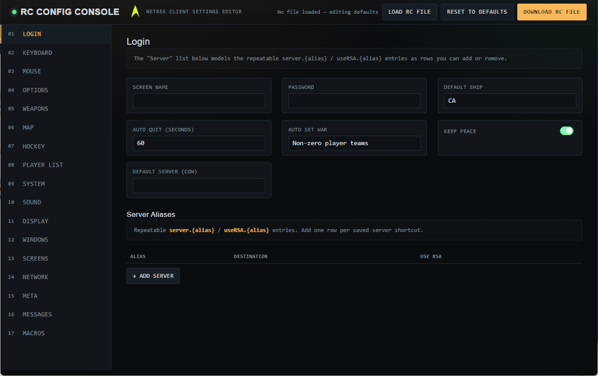

# netrekrc-config

Web based app to edit [Netrek's](https://netrek.org/) netrekrc configuration files.

## Description

This is a stand alone web page to open existing netrekrc files and to export settings to a new config file.



### Dependencies

* Modern Web browser

### Installing

* Clone the repository to a folder on your system.
```
git clone https://github.com/mwyatt81/netrekrc-config
```
* Open the index.html file in the web browser

## Updates
Changes to available configuration options can be done by editing the schema.js file.

## Authors
Contributors names and contact info

M. Wyatt
internetworker911@gmail.com

## Version History

* 0.1
    * Initial Release

## License

This project is licensed under the GNU GPL 3 License - see the LICENSE.txt file for details
